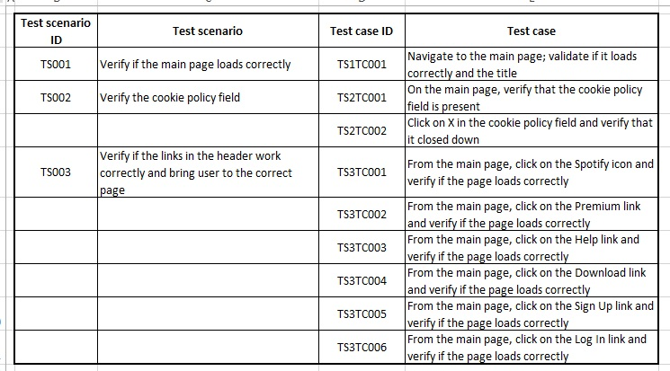

# Spotify_Project
A Page Object model implementation of a test scenario covering the testing of the header of the main Spotify page - UK version. Testing performed in Chrome browser. Code implemented in Eclipse using Selenium WebDriver and TestNG.

### Prerequisites
To run the project, you will need:

* JDK 8 - you can download [here](https://www.oracle.com/technetwork/java/javase/downloads/jdk8-downloads-2133151.html).
* Eclipse - you can download [here](https://www.eclipse.org/downloads/packages/).
* Maven integration for Eclipse.
* TestNG - you can download 'TestNG for Eclipse' plug-in.
* Chrome Driver - It's already added to the project in the src/test/resources/drivers folder.

Maven uses the below dependencies:
* Selenium WebDriver - used version 3.141.59.
* TestNG - used version 6.14.3.

### Running the test
In order to perfom the testing, run MainPageTest.java file.

Address of a website being tested:
https://www.spotify.com/uk/

The test convers the header and the main content, without the footer.

Screenshot of a wesbite being tested:

Sample screenshot of the Excel file:

### Acknowledgments
* _Selenium Testing Tools Cookbook_, Second Edition, Unmesh Gundecha
* Youtube videos
* Online tutorials - e.g. www.toolsqa.com, www.guru99.com
